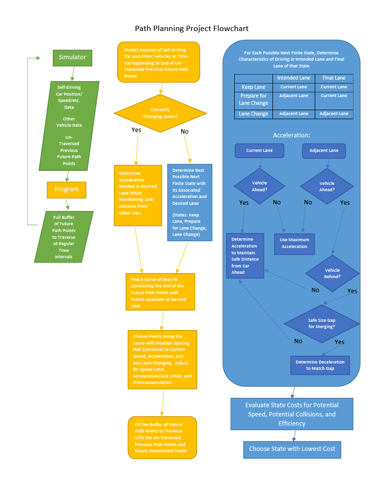

### This is Gabe Johnson's completed project for the Path Planning course in Udacity's Self-Driving Car Nanodegree.

The original assignment repo can be found here [Udacity Repo] (https://github.com/udacity/CarND-Path-Planning-Project)

## Goal:
The goal is to navigate a car in a simulator that represents a highway with other vehicles.  The simulator provides a sparse map list of waypoint coordinates of the highway's path.  The simulator also provides cyclically updated localization data for the car itself and sensor fusion data of the surrounding vehicles. The assignment is to generate a trajectory of coordinates that the self-driving car should traverse.  This trajectory must take into account the curvature of the highway as well as the behavior of other vehicles on the road.  The self-driving car should travel the fastest route possible while staying under the speed limit, avoiding collisions, staying in its lane unless performing a lane change, and avoiding uncomfortable acceleration and jerk.  The self-driving car must pass slow moving traffic when safe to do so.

This video shows the self-driving vehicle in my program as it travels through the simulator.  The green dots in front of the car represent the points along the future path that the program is generating.  The car traverses one point every 0.02 seconds.  You can see that the car accelerates and decelerates smoothly, keeping acceleration under 10 m/s^2 and jerk under 10 m/s^3.  It stays under the 50 MPH speed limit and stays in its lane when it should.  When it approaches slow traffic, the future path adjusts to keep a safe distance while the program evaluates whether a lane change is safe and beneficial.  When passing other vehicles, the future path adjusts to smoothly transition the car into the new lane.

[]


## Method:
This program uses a Finite State Machine strategy to choose appropriate lane changing behavior. 

The finite states are:
  * Keep Lane
  * Prepare Lane Change Left
  * Prepare Lane Change Right
  * Lane Change Left
  * Lane Change Right

The program uses cost functions to evaluate the merit of each possible state change (see `calculate_cost()` in `cost.cpp`), which optimizes around preventing collisions, achieving the fastest speed, and avoiding frivolous back-and-forth lane changes.

In preparing to evaluate the costs of each possible next state, the code creates a vector of two Vehicle class objects called `trajectory`, with one object representing the "intended lane" and one representing the "final lane" of that particular state (see `keep_lane_trajectory()`, `prep_lane_change_trajectory()`, and `lane_change_trajectory()` in `vehicle.cpp`).  These objects contain information about which lane is being considered, the maximum speed possible in that particular lane, and the acceleration/deceleration that the vehicle needs in order to position itself relative to the surrounding traffic (see `get_kinematics()` in `vehicle.cpp`).  

Each cycle, the code sends the simulator a full buffer of future points for the vehicle to traverse, and then the simulator sends back the remaining points that have not been traversed in that cycle (`previous_path_x` and `previous_path_y`).  The program then fills the buffer back up with points and the cycle repeats.  The new points are determined by first creating a "spline" polynomial function which defines a curve that connects the end of the remaining previous points to some future points in the desired lane (see `main.cpp` lines 224-295 and `spline.h`).  Since the simulator traverses one point every 0.02 seconds, the speed and acceleration of the car is controlled by the distance spacing between each point.  So each sequential gap is determined for motion in the forward direction, and then a corresponding lateral displacement is found by feeding that gap as an x coordinate into the spline function and determining a corresponding y coordinate.  Once those coordiantes are found, they are mapped back onto the road and used to fill up the buffer of points to send to the simulator (see `main.cpp` lines 301-347).  

Below is a flowchart to give a generalized overview of the code.  Note that the blue flowchart is nested within the yellow flowchart, which is in turn nested within the green flowchart.



I do need to give some credit to a few sources.  My implementation draws on the concepts taught in the "Implement Behavior Planner" excercise in Udacity's course, and some sections of the code are loosely modeled after functions used in that exercise.  I also used the spline function and a few other ideas as described by the instructors in the "Q&A".


## Instructions for Use:
You can download the Term3 Simulator which contains the Path Planning Project from the [releases tab (https://github.com/udacity/self-driving-car-sim/releases/tag/T3_v1.2). 

Once the install for uWebSocketIO is complete (see dependencies below), the main program can be built and run by doing the following from the build directory

Basic Build Instructions:

1. Clone this repo.
2. Make a build directory: `mkdir build && cd build`
3. Compile: `cmake .. && make`
4. Run it: `./path_planning`.

Then start the Term 3 Simulator.

Dependencies:

* cmake >= 3.5
  * All OSes: [click here for installation instructions](https://cmake.org/install/)
* make >= 4.1
  * Linux: make is installed by default on most Linux distros
  * Mac: [install Xcode command line tools to get make](https://developer.apple.com/xcode/features/)
  * Windows: [Click here for installation instructions](http://gnuwin32.sourceforge.net/packages/make.htm)
* gcc/g++ >= 5.4
  * Linux: gcc / g++ is installed by default on most Linux distros
  * Mac: same deal as make - [install Xcode command line tools]((https://developer.apple.com/xcode/features/)
  * Windows: recommend using [MinGW](http://www.mingw.org/)
* [uWebSockets](https://github.com/uWebSockets/uWebSockets)
  * Run either `install-mac.sh` or `install-ubuntu.sh`.
  * If you install from source, checkout to commit `e94b6e1`, i.e.
    ```
    git clone https://github.com/uWebSockets/uWebSockets 
    cd uWebSockets
    git checkout e94b6e1
    ```

